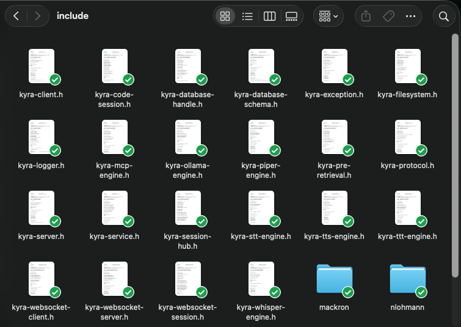
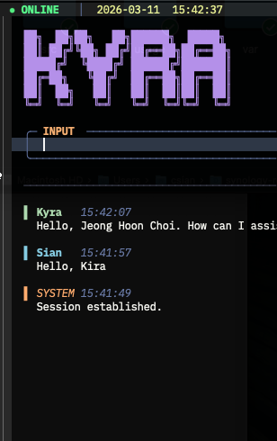
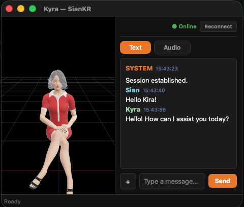

<!-- 
	***
	*   README.md
	*	
	*	Author: Jeong Hoon (Sian) Choi
	*	License: MIT
	*	
	***
-->

 

	
	<h3 align="center">Kyra-Server</h3>
	
	
	
	
	
	
	

	 
	 
	<a href="https://github.com/csian98/sian">
		<strong>Explore the docs »</strong>
	</a>
	 
	 
	<a href="https://github.com/csian98/kyra-server/issues/new?labels=bug&template=bug-report---.md">Report Bug</a>
	·
	<a href="https://github.com/csian98/kyra-server/issues/new?labels=enhancement&template=feature-request---.md">Request Feature</a>
	

	
Table of Contents

	<ol>
		<li>
			<a href="#about-the-project">About The Project</a>
			<ul>
				<li><a href="#development-environment">Development Environment</a>
			</ul>
			<ul>
				<li><a href="#built-with">Built With</a></li>
			</ul>
		</li>
		<li>
			<a href="#getting-started">Getting Started</a>
			<ul>
				<li>
					<a href="#prerequisites">Prerequisites</a>
				</li>
				<li>
					<a href="#installation">Installation</a>
				</li>
			</ul>
		</li>
		<li>
			<a href="#usage">Usage</a>
		</li>
		<li>
			<a href="#roadmap">Roadmap</a>
		</li>
		<li>
			<a href="#license">License</a>
		</li>
		<li>
			<a href="#contact">Contact</a>
		</li>
  </ol>

## About The Project

![Language][language-shield]
![repo size][repo-size-shield]
![weekly commits][commit-activity-shield]
![last commit][last-commit-shield]
[![MIT License][license-shield]][license-url]

Kyra is a C/C++ based Local AI Agent system developed by Jeong Hoon Choi for personal use.
It can optionally control input and output using TTS, LLM, and STT processes, and is available on the network using a WebSocket client.
LLM is implemented to use MCPServer, which allows for the extension of the LLM model's tools.

### Kyra-Clients
The Currently implemented Clients are as follows:

* Kyra-Client for Emacs

* Kyra-Client for Qt App (implement for mac)

* Kyra-Client for Raspberry Pi (Voice Control Only)

(<a href="#readme-top">back to top</a>)

## 🔐 License

Copyright © 2026, *Jeong Hoon Choi* or *Sian*. All rights reserved
Distributed under the MIT License. See `LICENSE` for more information.

(<a href="#readme-top">back to top</a>)

## 📞 Contact

Jeong Hoon (Sian) Choi - [@csian98](https://instagram.com/csian98) - [csian7386@gmail.com](mailto:csian7386@gmail.com)

Project Link: [https://github.com/csian98/sian](https://github.com/csian98/sian)

(<a href="#readme-top">back to top</a>)

[language-shield]: https://img.shields.io/github/languages/top/csian98/kyra-server.svg?style=for-the-badge
[code-size-shield]: https://img.shields.io/github/languages/code-size/csian98/kyra-server.svg?style=for-the-badge
[repo-size-shield]: https://img.shields.io/github/repo-size/csian98/kyra-server.svg?style=for-the-badge
[commit-activity-shield]: https://img.shields.io/github/commit-activity/w/csian98/kyra-server.svg?style=for-the-badge
[last-commit-shield]: https://img.shields.io/github/last-commit/csian98/kyra-server.svg?style=for-the-badge
[license-shield]: https://img.shields.io/github/license/csian98/kyra-server.svg?style=for-the-badge
[license-url]: https://github.com/csian98/kyra-server/blob/main/LICENSE

[macos-shield]: https://img.shields.io/badge/mac%20os-000000?style=for-the-badge&logo=macos&logoColor=F0F0F0
[macos-url]: https://developer.apple.com/macos
[archlinux-shield]: https://img.shields.io/badge/Arch%20Linux-1793D1?logo=arch-linux&logoColor=fff&style=for-the-badge
[archlinux-url]: https://archlinux.org
[cuda-shield]: https://img.shields.io/badge/NVIDIA%20CUDA-RTX4060-76B900?style=for-the-badge&logo=nvidia&logoColor=white
[cuda-url]: https://docs.nvidia.com/cuda/cuda-c-programming-guide/

[sqlite-shield]: https://img.shields.io/badge/sqlite-%2307405e.svg?style=for-the-badge&logo=sqlite&logoColor=white
[mariadb-shield]: https://img.shields.io/badge/MariaDB-003545?style=for-the-badge&logo=mariadb&logoColor=white
[mariadb-url]: https://mariadb.com/docs/server/connect/
[mongodb-shield]: https://img.shields.io/badge/MongoDB-%234ea94b.svg?style=for-the-badge&logo=mongodb&logoColor=white
[slack-shield]: https://img.shields.io/badge/Slack%20API-4A154B?style=for-the-badge&logo=slack&logoColor=white
[slack-url]: https://api.slack.com
[openai-shield]: https://img.shields.io/badge/openAI%20API-74aa9c?style=for-the-badge&logo=openai&logoColor=white
[openai-url]: https://platform.openai.com/docs/api-reference

[openssl-shield]: https://img.shields.io/badge/OpenSSL-721412?style=for-the-badge&logo=OpenSSL
[openssl-url]: https://www.openssl.org
[curl-shield]: https://img.shields.io/badge/curl-073551?style=for-the-badge&logo=curl
[curl-url]: https://curl.se

[hadoop-shield]: https://img.shields.io/badge/Apache%20Hadoop-66CCFF?style=for-the-badge&logo=apachehadoop&logoColor=black
[tensorflow-shield]: https://img.shields.io/badge/TensorFlow-%23FF6F00.svg?style=for-the-badge&logo=TensorFlow&logoColor=white

[c-shield]: https://img.shields.io/badge/C-00599C?style=for-the-badge&logo=c&logoColor=white
[cpp-shield]: https://img.shields.io/badge/C%2B%2B-00599C?style=for-the-badge&logo=c%2B%2B&logoColor=white
[python-shield]: https://img.shields.io/badge/Python-FFD43B?style=for-the-badge&logo=python&logoColor=blue
[elisp-shield]: https://img.shields.io/badge/Emacs%20Lisp-%237F5AB6.svg?&style=for-the-badge&logo=gnu-emacs&logoColor=white
[r-shield]: https://img.shields.io/badge/R-276DC3?style=for-the-badge&logo=r&logoColor=white
[shell-shield]: https://img.shields.io/badge/Shell_Script-121011?style=for-the-badge&logo=gnu-bash&logoColor=white

[keras-shield]: https://img.shields.io/badge/Keras-%23D00000.svg?style=for-the-badge&logo=Keras&logoColor=white
[pytorch-shield]: https://img.shields.io/badge/PyTorch-%23EE4C2C.svg?style=for-the-badge&logo=PyTorch&logoColor=white
